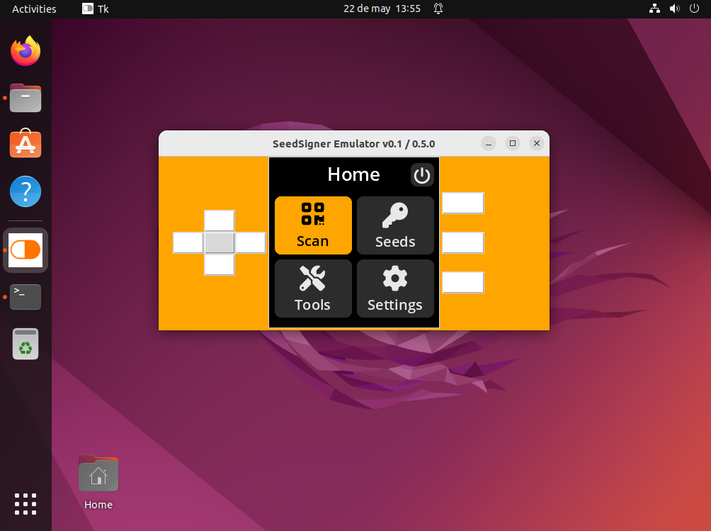

# SeedSigner Emulator
> Allows to execute [SeedSigner](https://github.com/SeedSigner) air-gapped hardware wallet in your desktop (windows/linux/mac)




## How it works
I made a new display driver that replaces the existing _SeedSigner ST7789 1.3_ driver, making possible to execute the device in a desktop enviroment.

>Use it with the integrated buttons or with your keyboard ( Arrow Keys, Enter, 1,2,3 )

I have tried to make it as non-invasive as possible so that the emulator can be used with other versions of Seedsigner with as little effort as possible.


## Launch from source

1- Clone the repository:

```sh
git clone --recursive https://github.com/enteropositivo/seedsigner-emulator.git
```

2- Install the following requeriments if needed:

```sh
python3 -m pip install --upgrade Pillow
python3 -m pip install --upgrade setuptools
sudo apt-get install python3-tk
sudo apt install libzbar0
pip3 install git+https://github.com/jreesun/urtypes.git@e0d0db277ec2339650343eaf7b220fffb9233241
pip3 install embit dataclasses pyzbar qrcode tk
```

3- Run:

```sh
./build
```

It will copy the seedsigner-emulator code into SeedSigner and will run it automatically.


## Making a standalone executable ( Optional )

You'll need to install PYinstaller to be able to generate an executable for your OS.

```sh
pip3 install pyinstaller
```
go to your proyect main forlder where _main.py_ stands and execute the following command

```sh
pyinstaller --clean --add-data seedsigner\\resources;seedsigner\\resources main.py
```
If you found an error **unable to execute command pyinstaller** try using the following command

```sh
python3 -m pyinstaller --clean --add-data seedsigner\\resources;seedsigner\\resources main.py
```

**Note:** I'll upload releases for linux and windows


## :lock: Security tips
- **Don't use it on an online computer** 
- SeedSigner Emulator only redirects inputs and display calls from _SeedSigner_ code to this _Emulator_ drivers,  you can check it making a diff to compare _hardware_ and _gui_ directories and files.


## Pending Tasks

- [x] Fix screen saver
- [ ] Fix keyboard capture on Linux (on windows works ok)
- [ ] Allow desktop webcam
- [ ] Test command to make a **one file** standalone executable
 


## :coffee: Buy me a Coffe

I can work faster and more motivated if you help me with a donation 

**bc1q554p5jqgdhle07cnc5cm6v6nu7ux9ztem8dggc**


## Contact

Follow me at Twitter – [@EnteroPositivo](https://twitter.com/enteropositivo)  


