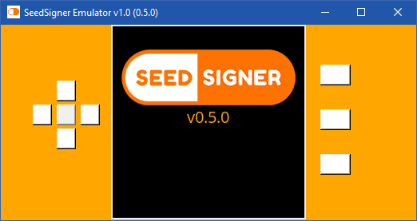
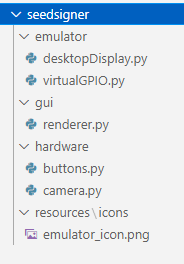

# SeedSigner Emulator
> Allows to execute [SeedSigner](https://github.com/SeedSigner) air-gapped hardware wallet in your desktop (windows/linux/mac)




## How it works
I made a new display driver that replaces the existing _SeedSigner ST7789 1.3_ driver, making possible to execute the device in a desktop enviroment.

I have tried to make it as non-invasive as possible so that the emulator can be used with other versions of Seedsigner with as little effort as possible.


## Usage from source

**1-** First clone [SeedSigner](https://github.com/SeedSigner/seedsigner) repo

```sh
git clone https://github.com/SeedSigner/seedsigner.git
```

**2-** Go to directory _seedsigner/src_

```sh
cd seedsigner/src
```

**3-** Download the contents of this respository [Seedsigner emulator (.zip)](https://github.com/enteropositivo/seedsigner-emulator/archive/refs/heads/master.zip) and merge the contents of the folder **seedsigner**



with the existing **seedsigner** content you cloned in step 1.  

**4-** Install the following requeriments:

```sh
pip3 install embit
python3 -m pip install --upgrade Pillow
python3 -m pip install --upgrade setuptools
pip3 install dataclasses
pip3 install pyzbar
pip3 install 
sudo apt install libzbar0
pip3 install git+https://github.com/jreesun/urtypes.git@e0d0db277ec2339650343eaf7b220fffb9233241
pip3 install qrcode 
sudo apt-get install python3-tk
pip3 install tk
```

**5-** Run the emulator
```sh
python3 main.py
```

## Making a standalone executable

You'll need to install PYinstaller to be able to generate an executable for your OS.

```sh
pip3 install pyinstaller
```
go to your proyect main forlder where _main.py_ stands and execute the following command

```sh
pyinstaller --clean --add-data seedsigner\\resources;seedsigner\\resources main.py
```
If you found an error **unable to execute command pyinstaller** try using the following command

```sh
python3 -m pyinstaller --clean --add-data seedsigner\\resources;seedsigner\\resources main.py
```

**Note:** I'll upload releases for linux and windows


## Pending Tasks

- [ ] Fix screen saver
- [ ] Allow desktop webcam


## Alpha release !!

This is the first release and there are still many things to be solved.  The webcam is not deployed and the screensaver is not working properly.

**so be patient because I will be solving everything**


## Contact

Follow me at Twitter – [@EnteroPositivo](https://twitter.com/enteropositivo)  


