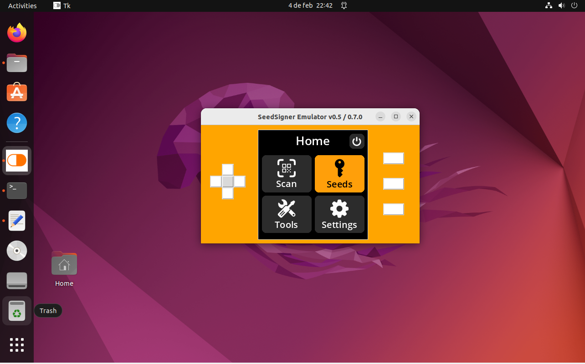

# SeedSigner Emulator
> Allows to execute [SeedSigner](https://github.com/SeedSigner) air-gapped hardware wallet in your desktop (windows/linux/mac)




## How it works
I made a new display driver that replaces the existing _SeedSigner ST7789 1.3_ driver, making possible to execute the device in a desktop enviroment.

>Use it with the integrated buttons or with your keyboard ( Arrow Keys, Enter, 1,2,3 )

I have tried to make it as non-invasive as possible so that the emulator can be used with other versions of Seedsigner with as little effort as possible.


## Launch from source

**1-** Clone [SeedSigner](https://github.com/SeedSigner/seedsigner) repository

```sh
git clone https://github.com/SeedSigner/seedsigner.git
cd seedsigner/src
```

**2-** Convert it into a desktop application

_Option 1_

Download the contents from this respository [Seedsigner emulator (.zip)](https://github.com/enteropositivo/seedsigner-emulator/archive/refs/heads/master.zip) and merge the contents of the folder 


with the existing **seedsigner** content you cloned in step 1. 


**OR**

_Option 2_

On the folder entered with the command `cd seedsigner/src`, using command line (the command rsync below will not work on Windows. You will need to copy from `seedsigner-emulator/seedsigner` the folder `emulator`, and the replace the following files: `gui\renderer.py`, `hardware\camera.py`, `hardware\buttons.py`, `hardware\pivideostream.py`, `resources\icons\emulator_icon.png`)

```sh
git clone http://github.com/enteropositivo/seedsigner-emulator.git
rsync -a seedsigner-emulator/seedsigner ./
```


**3-** Install the following requeriments:

```sh
python3 -m pip install pillow==9.5.0
python3 -m pip install --upgrade setuptools
sudo apt-get install python3-tk
sudo apt install libzbar0
pip3 install git+https://github.com/selfcustody/urtypes.git
pip3 install git+https://github.com/enteropositivo/pyzbar.git@a52ff0b2e8ff714ba53bbf6461c89d672a304411#egg=pyzbar
pip3 install embit dataclasses qrcode tk opencv-python
```

**4-** Launch the emulator
```sh
cd src
python3 main.py
```

Note: On Windows you can either interact with the buttons at the window or use keyboard arrows, Enter, Numpad_1, Numpad_2, Numpad_3

## ZBar library for Windows

When you get this error executing the project: `FileNotFoundError: Could not find module 'libiconv-2.dll' (or one of its dependencies). Try using the full path with constructor syntax.` on Windows platform you should download all of pyzbar `.dll` files  from [https://github.com/enteropositivo/pyzbar/releases/tag/v0.1.10-ss](https://github.com/enteropositivo/pyzbar/releases/tag/v0.1.10-ss) -  just copy all the `.dll` files to the folder listed right before the error, mine was: `C:\Users\MYUSER\AppData\Local\Programs\Python\Python39\lib\site-packages\pyzbar` (remember to replace MYUSER with yours) - ZBar library v0.23.91

## Other errors

If you get this error: `ValueError: mutable default <class 'seedsigner.views.view.Destination'> for field next_destination is not allowed: use default_factory` - edit the file `seedsigner\src\seedsigner\views\view.py` and change the line: `next_destination: Destination = Destination(MainMenuView, clear_history=True)` to `next_destination: Destination = None`

## Making a standalone executable ( Optional )

You'll need to install PYinstaller to be able to generate an executable for your OS.

```sh
pip3 install pyinstaller
```
go to your proyect main forlder where _main.py_ stands and execute the following command

```sh
pyinstaller --clean --add-data seedsigner\\resources;seedsigner\\resources main.py
```
If you found an error **unable to execute command pyinstaller** try using the following command

```sh
python3 -m pyinstaller --clean --add-data seedsigner\\resources;seedsigner\\resources main.py
```

**Note:** I'll upload releases for linux and windows


## Intalling on TAILS OS

These are some notes that could help you installing Seedsigner Emulator on Tails OS

```sh
sudo apt-get update
sudo apt-get upgrade
sudo apt-get install python3-pip

git clone http://github.com/seedsigner/seedsigner.git
cd seedsigner/src

git clone http://github.com/enteropositivo/seedsigner-emulator.git
rsync -a seedsigner-emulator/seedsigner ./
```

Now install all requeriments from previous (section 3)

**Installing pip packages**
- download them from pypi.org
- install with:

```sh
sudo python3 setup.py install  PACKAGE_NAME
```

**If some pip package fails to install with previous method use the folowwing one:**
Download from pypi.org ("download files" section) the corresponding  .whl 

```sh
pip install  PACKAGE_FILE.whl 
```

**Warning!  Install Pillow downloading package from   https://pypi.org/project/Pillow/#files**

```sh
pip install Pillow-9.5.0-cp39-cp39-manylinux_2_28_x86_64.whl
```


**Problem with sockets downloading or installing some pip package ? USE TORSOCKS**
```sh
torsocks pip3 install ...
```

**Finally install**
- zbarcam


## :lock: Security tips
- **Don't use it for real transactions** 
- This emulator is made for testing Seedsigner source code on your desktop.   
- You can modify or contribute to seedsigner without the need to upload the code to a  Raspberry Pi Zero each time 


## Pending Tasks

- [x] Fix screen saver
- [x] Fix keyboard capture on Linux (on windows works ok)
- [x] Allow desktop webcam
- [x] Test command to make a **one file** standalone executable
- [x] Fix reading QR from desktop webcam
 


## :coffee: Buy me a Coffe

⚡ enteropositivo@getalby.com

## Contact

Follow me at Twitter – [@EnteroPositivo](https://twitter.com/enteropositivo)  


